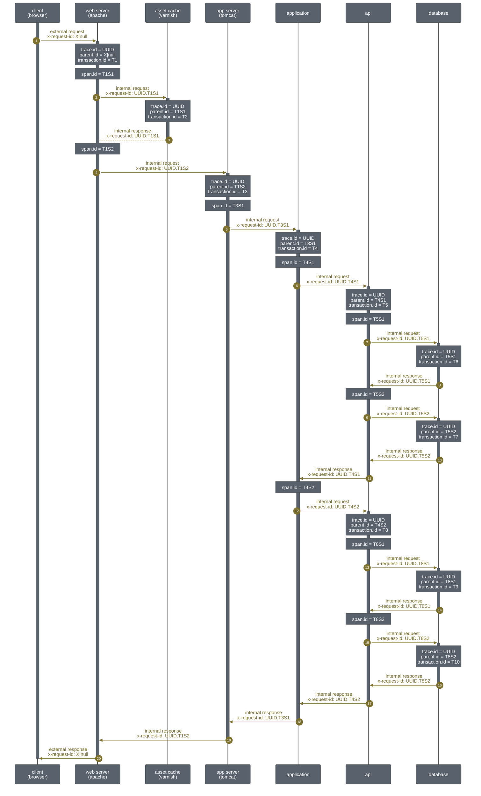

[![license][license-img]][license-url]
[![latest tag][latest-tag-img]][latest-tag-url]
[![latest release][latest-release-img]][latest-release-url]

[![issue resolution][issue-resolution-img]][issue-resolution-url]
[![open issues %][open-issues-percent-img]][open-issues-percent-url]
[![open issues #][open-issues-number-img]][open-issues-number-url]
[![open pull requests][open-pull-requests-img]][open-pull-requests-url]

[![build][build-img]][build-url]
[![analyze][analyze-img]][analyze-url]
[![dependabot][dependabot-img]][dependabot-url]

[![languages][languages-img]][languages-url]
[![alerts][alerts-img]][alerts-url]
[![code quality][code-quality-img]][code-quality-url]

[![maintainability][maintainability-img]][maintainability-url]
[![technical debt][technical-debt-img]][technical-debt-url]
[![vulnerabilities][vulnerabilities-img]][vulnerabilities-url]

# unique-id-filter

This servlet filter generates a UUID4 for each servlet request.

Why? To support the [Elastic Common Scheme](https://www.elastic.co/guide/en/ecs/current/index.html) tracing fields (trace.id, parent.id, transation.id, and span.id) in [tomcat9](https://tomcat.apache.org/tomcat-9.0-doc/).

The following sequence diagram (install this [browser extension](https://github.com/marcozaccari/markdown-diagrams-browser-extension) to render the diagram... why doesn't github support [mermaid](https://mermaid-js.github.io/mermaid/#/)?!?) explains how these tracing fields are propagated through a tech stack.

Effectively, the rules are:

* the external request is assigned a trace.id that is propagaged throughout the tech stack
* incoming requests are assigned a transaction.id
* outgoing requests are assgined a span.id

[alerts-img]: https://badgen.net/lgtm/alerts/g/LucaFilipozzi/unique-id-filter/java?icon=lgtm
[alerts-url]: https://lgtm.com/projects/g/LucaFilipozzi/unique-id-filter/alerts
[analyze-img]: https://github.com/LucaFilipozzi/unique-id-filter/actions/workflows/analyze.yml/badge.svg
[analyze-url]: https://github.com/LucaFilipozzi/unique-id-filter/actions/workflows/analyze.yml
[build-img]: https://github.com/LucaFilipozzi/unique-id-filter/actions/workflows/build.yml/badge.svg
[build-url]: https://github.com/LucaFilipozzi/unique-id-filter/actions/workflows/build.yml
[code-quality-img]: https://badgen.net/lgtm/grade/g/LucaFilipozzi/unique-id-filter/java?icon=lgtm
[code-quality-url]: https://lgtm.com/projects/g/LucaFilipozzi/unique-id-filter/context:java
[dependabot-img]: https://badgen.net/github/dependabot/LucaFilipozzi/unique-id-filter?icon=dependabot
[dependabot-url]: https://github.com/LucaFilipozzi/unique-id-filter/network/dependencies
[issue-resolution-img]: http://isitmaintained.com/badge/resolution/LucaFilipozzi/unique-id-filter.svg
[issue-resolution-url]: http://isitmaintained.com/project/LucaFilipozzi/unique-id-filter
[languages-img]: https://badgen.net/lgtm/langs/g/LucaFilipozzi/unique-id-filter?icon=lgtm
[languages-url]: https://lgtm.com/projects/g/LucaFilipozzi/unique-id-filter/logs/languages/lang:java
[latest-release-img]: https://badgen.net/github/release/LucaFilipozzi/unique-id-filter?icon=github&label=latest%20release
[latest-release-url]: https://github.com/LucaFilipozzi/unique-id-filter/releases/latest
[latest-tag-img]: https://badgen.net/github/tag/LucaFilipozzi/unique-id-filter?icon=github
[latest-tag-url]: https://github.com/LucaFilipozzi/unique-id-filter/tags
[license-img]: https://badgen.net/github/license/LucaFilipozzi/unique-id-filter?icon=github
[license-url]: https://github.com/LucaFilipozzi/unique-id-filter/blob/main/LICENSE.md
[maintainability-img]: https://badgen.net/codeclimate/maintainability/LucaFilipozzi/unique-id-filter?icon=codeclimate
[maintainability-url]: https://codeclimate.com/github/LucaFilipozzi/unique-id-filter/maintainability
[open-issues-number-img]: https://badgen.net/github/open-issues/LucaFilipozzi/unique-id-filter?icon=github
[open-issues-number-url]: https://github.com/LucaFilipozzi/unique-id-filter/issues
[open-issues-percent-img]: http://isitmaintained.com/badge/open/LucaFilipozzi/unique-id-filter.svg
[open-issues-percent-url]: http://isitmaintained.com/project/LucaFilipozzi/unique-id-filter
[open-pull-requests-img]: https://badgen.net/github/open-prs/LucaFilipozzi/unique-id-filter?icon=github
[open-pull-requests-url]: https://github.com/LucaFilipozzi/unique-id-filter/pulls
[technical-debt-img]: https://badgen.net/codeclimate/tech-debt/LucaFilipozzi/unique-id-filter?icon=codeclimate
[technical-debt-url]: https://codeclimate.com/github/LucaFilipozzi/unique-id-filter/maintainability
[vulnerabilities-img]: https://badgen.net/snyk/LucaFilipozzi/unique-id-filter/main/pom.xml
[vulnerabilities-url]: https://snyk.io/test/github/lucafilipozzi/unique-id-filter?targetFile=pom.xml
